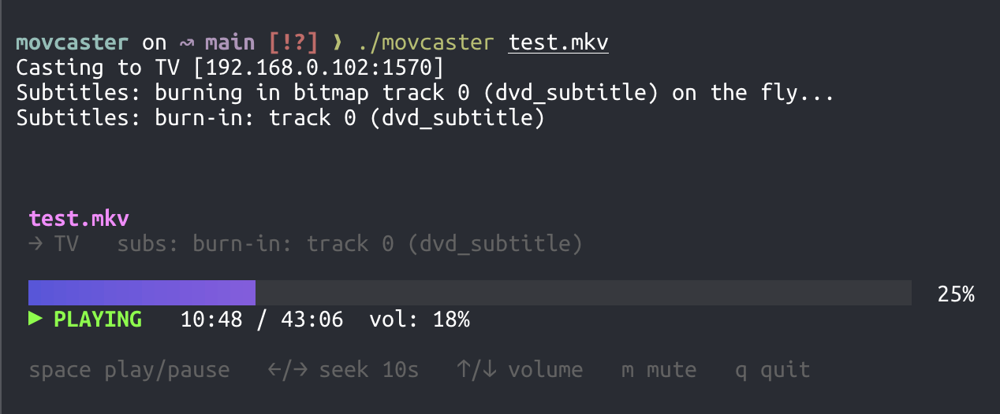

# movcaster

[](https://github.com/juliocesar/movcaster/releases/latest)
[](https://github.com/juliocesar/homebrew-tap)
[](https://github.com/juliocesar/movcaster/actions/workflows/release.yml)
[](https://pkg.go.dev/github.com/juliocesar/movcaster)

Throw a movie from your laptop onto the TV from the comfort of your terminal. 📺

movcaster is a terminal-only (CLI + TUI) tool that streams local video to a DLNA
renderer (built for an LG webOS TV) over wifi, with **soft** *and* **burned-in**
subtitle support — including the bitmap subtitle tracks (VobSub/PGS/`dvd_subtitle`)
that go2tv just shrugs at. No browser, no app, no cables. One binary.

Binge-friendly, too: it [auto-plays the next episode](#next-episode-automatically)
in the folder when one ends, and casts a [playlist](#playlists) of files in order.



## Install

**Homebrew** (macOS/Linux — pulls in `ffmpeg` for you):

```sh
brew install juliocesar/tap/movcaster
```

movcaster is distributed as a cask. To upgrade, refresh the tap first, then
upgrade — without `brew update` the tap metadata is stale and the upgrade is a
no-op (note: `brew update movcaster` is *not* a thing — `update` takes no package
name; use `upgrade` to bump a package):

```sh
brew update && brew upgrade --cask movcaster
```

**Go** (if you have the toolchain):

```sh
go install github.com/juliocesar/movcaster@latest
```

**Prebuilt binaries:** grab a tarball for your OS/arch from the
[releases page](https://github.com/juliocesar/movcaster/releases), unpack it, and
drop `movcaster` somewhere on your `PATH`.

**From source:**

```sh
git clone https://github.com/juliocesar/movcaster && cd movcaster
go build -o movcaster .
```

> **Heads up:** every method except Homebrew assumes `ffmpeg` and `ffprobe` are on
> your `PATH` already (`brew install ffmpeg`). movcaster shells out to them and will
> tell you politely if they're missing.

## Quick start

```sh
# Who's out there?
movcaster -l

# Cast it. Subtitles and codecs are figured out for you.
movcaster "Some Show S01E01.mkv"
```

That's the whole pitch: point it at a file, hit play, grab the popcorn. 🍿

## More examples

```sh
# Peek at what's inside (and what subtitle plan it'd pick) without casting:
movcaster --info "Movie (1080p BluRay x265).mkv"

# Pin a specific TV (handy if you own more than one):
movcaster -t 192.168.1.42 episode.mkv

# Bring your own subtitles:
movcaster --sub Movie.es.srt Movie.mkv

# The file has five subtitle tracks and you want track 3 (run --info to list them):
movcaster --sub-track 3 Movie.mkv

# Force the burned-in path (always works, even on the weirdest bitmap subs):
movcaster --burn Movie.mkv

# Silence, please — no subtitles at all:
movcaster --no-subs Movie.mkv

# Binge a season: when an episode ends, the next one in the folder auto-plays
# (press n to skip ahead, --no-next to turn it off):
movcaster "Hannibal S01E01.mkv"

# Got a specific lineup? List the files and play them top to bottom:
movcaster --playlist tonight.txt
```

The first device you cast to is remembered (`~/.config/movcaster/config.json`),
so plain `movcaster <file>` keeps finding your TV — even after it reboots and
shuffles its DLNA port around.

### TUI controls

Once it's playing you get a little control panel:

`space` play/pause · `←/→` seek 10s · `↑/↓` volume · `m` mute · `s` subtitles · `n` next episode · `q` quit

Press `s` to open a subtitle picker: it lists every embedded track, any sidecar
file, and **Off**. Pick one and movcaster re-points the TV at a freshly built
stream and resumes where you were (text tracks go soft, bitmap tracks burn in).

## All the flags

```
movcaster -l                       list DLNA renderers on the LAN
movcaster <file>                   cast (auto subtitles + auto codec fallback)
movcaster <file> -t TARGET         target a device (IP, IP:port, or device URL)
movcaster <file> --info            print streams + the chosen subtitle strategy
movcaster <file> --sub foo.srt     force an explicit soft subtitle
movcaster <file> --sub-track N     pick embedded subtitle track N (see --info)
movcaster <file> --burn            burn the selected subtitle into the video
movcaster <file> --soft            force soft subs (errors on bitmap tracks)
movcaster <file> --mux-soft        remux a bitmap track as soft (experimental)
movcaster <file> --no-subs         cast without subtitles
movcaster <file> --transcode       force a codec-compatibility transcode
movcaster <file> --no-next         don't auto-play the next episode when one ends
movcaster --resume                 continue the last played video
movcaster --playlist list.txt      cast each file in a playlist, in order
```

## How subtitles are chosen

movcaster picks a strategy so you don't have to:

1. A sidecar `.srt`/`.vtt` (or `--sub`) → **soft** subs via the DLNA caption
   mechanism (`sec:CaptionInfoEx`). The TV draws them; size/style live in the TV's
   caption settings.
2. An embedded **text** track → extracted to WebVTT → **soft**.
3. A **bitmap** track (`dvd_subtitle`/PGS/VobSub) → **burned in** on the fly with
   ffmpeg `overlay` (playback starts in seconds; no full pre-encode).
   `--mux-soft` instead remuxes it as a soft track to try the TV's own renderer.

Curious what it'll do? `movcaster <file> --info` shows the decision without casting.

## Resume where you left off

Stop a movie partway and movcaster remembers. Next time you open the same file it
picks up right where you stopped — no fiddling with the seek bar. Positions are
saved per file (by absolute path) in `~/.movcaster/playback_index` when playback
stops or you quit. Finished something? It's cleared automatically, so a rewatch
starts from the top.

Don't remember which file you had on? `movcaster --resume` (no file argument)
picks the most recently played video and continues it. If that file has since
moved, it falls back to the next most recent. From there it behaves like a normal
cast, auto-advancing to the next episode on end unless you pass `--no-next`.

## Next episode, automatically

Casting a TV episode? When it ends, movcaster looks in the same folder for the
next episode of the same show and casts it — so a season just keeps playing.
It reads the season/episode out of the filenames (`Hannibal S01E01.mkv` →
`Hannibal S01E02.mkv`, tolerating different spacing and casing) and only advances
within the same show, so it never wanders off into an unrelated movie sitting in
the same folder. Press `n` to jump to the next episode early, or pass `--no-next`
to switch the whole thing off. A standalone movie with no episode number simply
plays and stops.

## Playlists

Have a specific lineup in mind? Drop the paths in a text file, one per line, and
cast the lot:

```
movcaster --playlist tonight.txt
```

```text
# tonight.txt — blank lines and # comments are ignored
/Volumes/media/Hannibal/S01E01.mkv
/Volumes/media/Hannibal/S01E02.mkv
shorts/interlude.mp4          # relative paths resolve from where you run movcaster
```

It plays them top to bottom; `n` skips to the next entry, `q` stops. Absolute
paths are used as-is, relative paths resolve against the current directory, and a
line pointing at a file that isn't there is skipped with a warning rather than
derailing the rest of the list. (Directory auto-advance is off in playlist mode —
the list is the running order.)

## Seeking

Direct-play files seek natively via HTTP byte ranges. During a transcode (burn-in
or codec fallback) the stream isn't byte-seekable, so a seek restarts ffmpeg at the
new offset (`-ss`) and re-points the TV at the fresh stream. You scrub; it copes.

## Layout

All the orchestration lives behind `internal/core`, so the CLI is a thin client —
and a future HTTP/GUI front-end would be too.

```
main.go                  thin CLI: parse flags -> core.CastRequest -> render + drive TUI
internal/core            the reusable API: plan a cast, start it, control it, tear it down
internal/discovery       SSDP discovery (goupnp) -> Device + service clients
internal/renderer        AVTransport + RenderingControl + DIDL-Lite building
internal/mediaserver     local HTTP server (direct-play range + transcode pipe)
internal/probe           ffprobe wrapper + subtitle classification
internal/subs            subtitle strategy + extract/burn/remux ffmpeg args
internal/transcode       codec-compatibility transcode args
internal/tui             bubbletea view layer
internal/config          remembers the last device
internal/resume          remembers playback position per file (~/.movcaster)
internal/nextep          finds the next episode in the directory (auto-advance)
internal/playlist        parses a playlist file (one video path per line)
```
